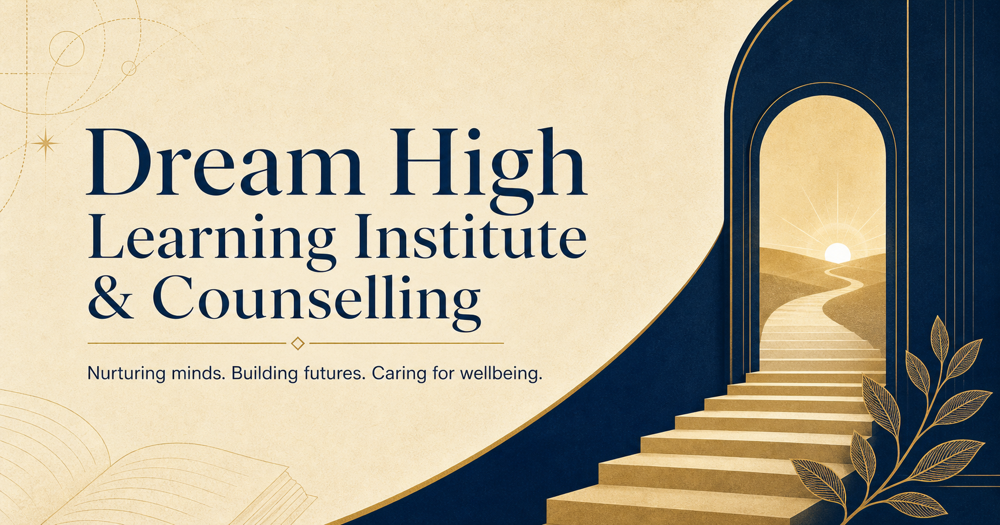
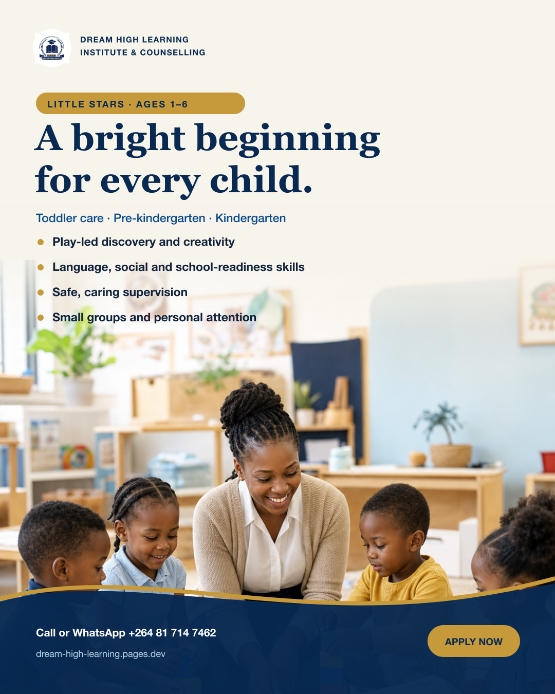
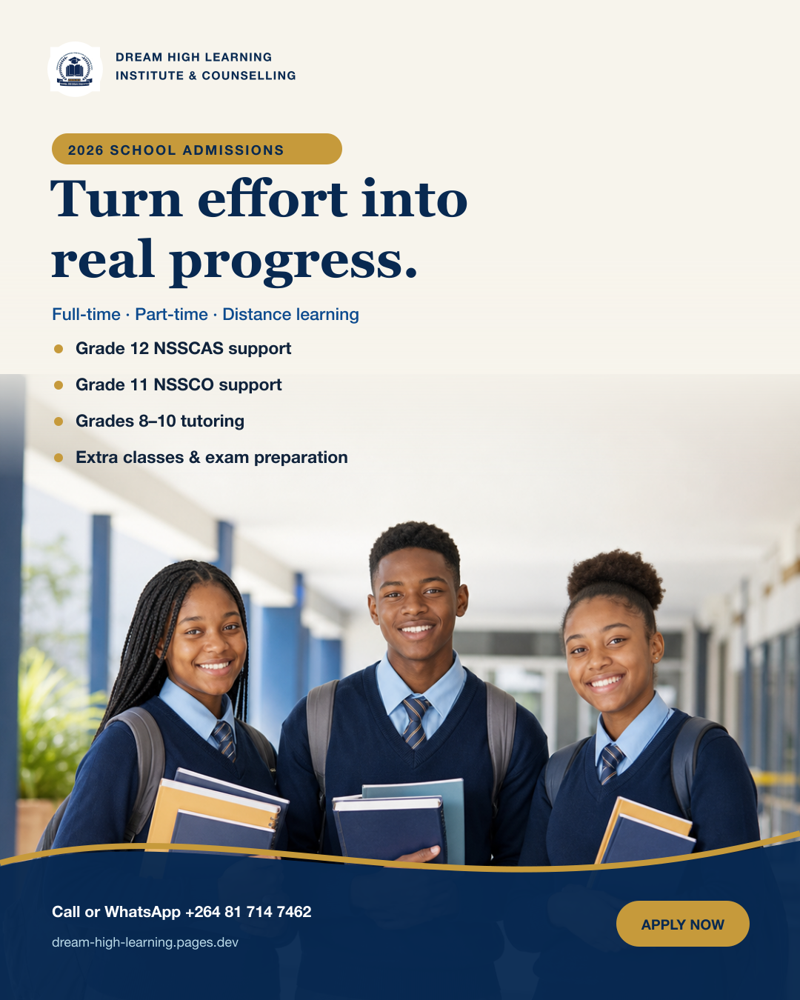
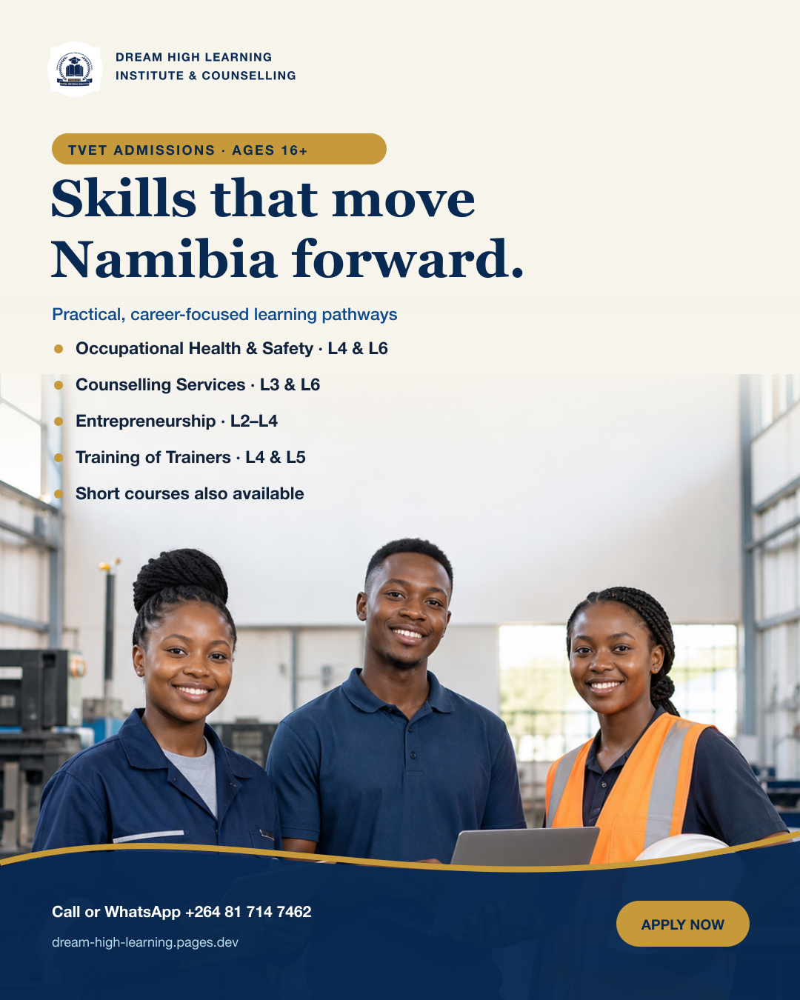

# Dream High Learning Institute & Counselling

A research-led digital identity and responsive website for a multidisciplinary education and counselling institute in Windhoek, Namibia.

**[Visit the live website](https://dream-high-learning.pages.dev/)**

## The brief

Dream High needed one confident digital home for a broad service offering: kindergarten, tutoring, after-school care, vocational training and counselling. The experience had to feel credible to parents and learners, remain easy to navigate on mobile devices and translate the institute's warm, ambitious character into a coherent public identity.

## Design approach

The project used a design-science mindset: understand the institution and its audiences, turn those needs into design requirements, build an integrated solution and refine it through repeated visual and functional evaluation.

The resulting system pairs scholarly navy with optimistic gold, editorial typography, tactile backgrounds and restrained motion. Programme pathways and calls to action are organised around the decisions a visitor is most likely to make, while the language remains welcoming and direct.

## Experience delivered

- Responsive, mobile-first institutional website
- Unified visual language across the website and campaign material
- Clear pathways for early learning, school support, vocational training and counselling
- Accessible skip navigation and semantic page landmarks
- Keyboard-friendly campaign gallery with accessible modal dialogs
- Safer, clearly communicated form submission feedback
- Lightweight motion with reduced-motion support
- Downloadable, public-safe application and information packs
- Direct phone, WhatsApp, email and location journeys
- Social-sharing artwork and live Facebook and LinkedIn links
- Canonical, favicon and robots metadata for reliable discovery
- Static, globally distributed Cloudflare Pages deployment

## Selected campaign work

| Kindergarten programme | School admissions | TVET and skills training |
| --- | --- | --- |
|  |  |  |

## Technical overview

The production experience is built with React, TypeScript, Vinext, Vite and Tailwind CSS. Every change to the private production repository passes automated linting, type-checking and a production build in GitHub Actions before deployment to the existing Cloudflare Pages project from the protected production branch.

The release workflow keeps known image-optimisation and media-caption opportunities visible as non-blocking warnings while preventing correctness, type and build regressions from reaching production.

## Release update · 19 September 2026

The latest production release strengthened both usability and delivery confidence:

- Replaced the campaign overlay with an accessible dialog pattern
- Corrected the skip-link destination and hero heading relationship
- Added canonical URL, favicon and robots metadata
- Hardened form-value handling and success messaging
- Added repeatable local quality-check scripts
- Promoted lint, type-check and production-build checks into the deployment workflow
- Verified the successful GitHub Actions run and live Cloudflare deployment

## Release update · 20 September 2026

- Added a quiet, linked SolarSpin Technologies authorship credit to the production footer without competing with the institute's identity
- Optimised the social sharing card to a lightweight 1200 × 630 JPEG and versioned its Open Graph URL for more reliable link previews in messaging and social apps

## My contribution

Strategy, design research, information architecture, visual direction, interaction design, responsive frontend implementation, accessibility refinement, content refinement, document-system alignment, media production and deployment engineering.

## Project status

The public release is live and the production pipeline is passing. Future iterations may add confirmed programme detail pages, secure application intake, optimised framework-managed imagery, caption tracks for campaign video and further original photography as the institution's content library grows.

## Confidentiality and rights

This public repository is a curated portfolio case study. Production source code, operational configuration, editable document masters and private institutional material are intentionally excluded.

The Dream High name, emblem and institutional content belong to Dream High Learning Institute & Counselling. Portfolio presentation and implementation are © 2026 Freeman Ipumbu. All rights reserved.
